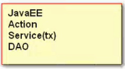

框架整合

根据框架的特点在javaee的分层开发中合理地对其进行使用

JavaEE业务分层

#SSM整合步骤

注：在整合过程当中可以使用properties文件帮助配置
##

首先进行Spring和Mybatis的整合

配置applicationContext.xml文件

>1.这个文件中配置数据库连接

>2.扫描Dao.xml

>3.扫描Mapper并将其生命周期纳入Spring管理

##

进行Spring和SpringMVC的整合

>1.配置springmvc.xml文件

>2.这个文件中配置扫描Controller并将其生命周期纳入Spring管理

>3.注解驱动，以使得访问路径与方法的匹配可以通过注解配置

>4.视图定位到jsp存放的文件当中(/WEB/INF当中的文件夹)

##

**剩下的就是bean、mapper、service、controller、interceptor的编写**